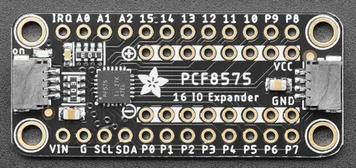

.. _adafruit_ina219:

Adafruit INA219 Shield
######################

Overview
********

The `Adafruit PCF8575 I2C 16 GPIO Expander Shield`_ features
a `TI INA219 current sensor`_ and two STEMMA QT connectors.
It measures current and bus voltage.

   Adafruit PCF8575 Shield (Credit: Adafruit)

Requirements
************

This shield can be used with boards which provide an I2C connector, for
example STEMMA QT or Qwiic connectors.
The target board must define a ``zephyr_i2c`` node label.
See :ref:`shields` for more details.

Pin Assignments
===============

+--------------+-------------------+
| Shield Pin   | Function          |
+==============+===================+
| SDA          | INA219 I2C SDA    |
+--------------+-------------------+
| SCL          | INA219 I2C SCL    |
+--------------+-------------------+
| VIN-         | Current sense neg |
+--------------+-------------------+
| VIN+         | Current sense pos |
+--------------+-------------------+

See :dtcompatible:`ti,ina219` for documentation on how to adjust the
devicetree file, to for example adjust the gain.

Programming
***********

Set ``--shield adafruit_ina219`` when you invoke ``west build``. For example
when running the :zephyr:code-sample:`ina219` sample:

.. zephyr-app-commands::
   :zephyr-app: samples/sensor/ina219
   :board: adafruit_qt_py_rp2040
   :shield: adafruit_ina219
   :goals: build

.. _Adafruit PCF8575 I2C 16 GPIO Expander Shield:
   https://learn.adafruit.com/adafruit-ina219-current-sensor-breakout

.. _TI INA219 Current sensor:
   https://www.ti.com/product/INA219
